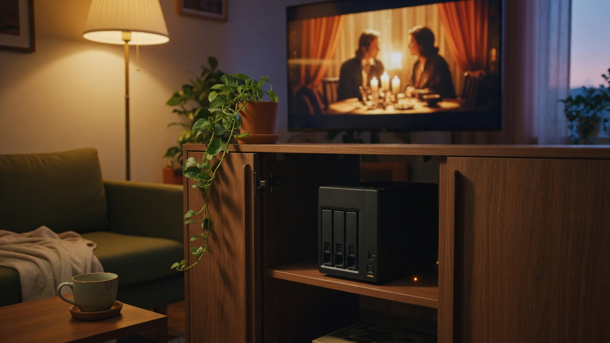
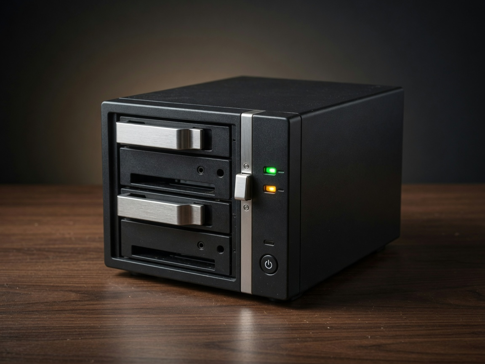
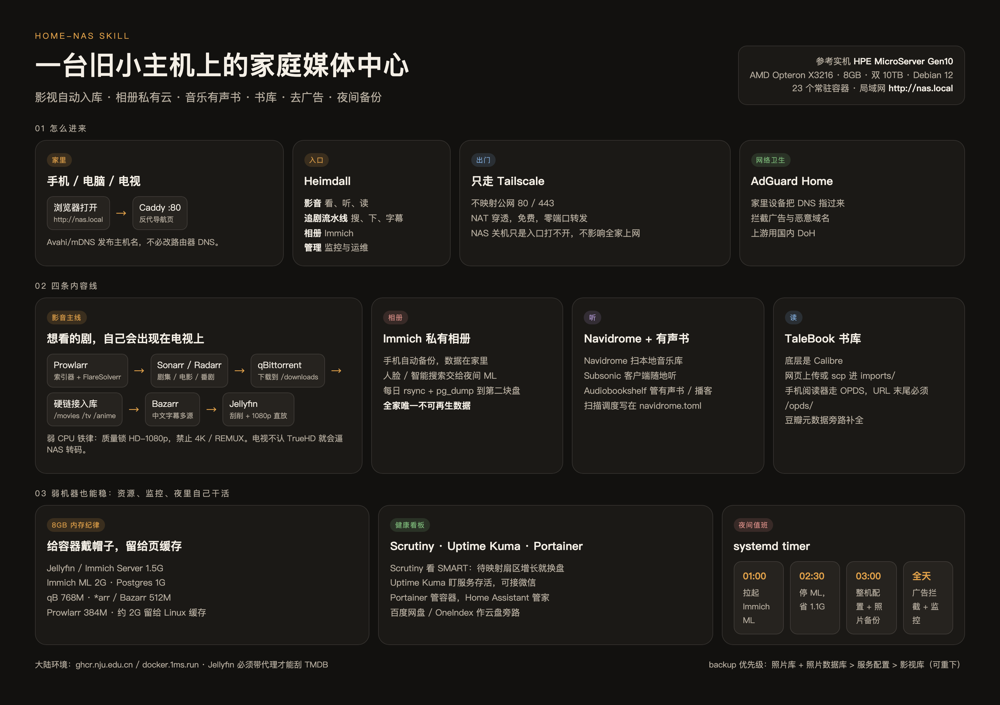

<p align="center">
  
</p>

<h1 align="center">home-nas</h1>

<p align="center">
  <strong>把闲置 x86 小主机搭成全自动家庭媒体中心。</strong><br />
  影视入库、私有相册、音乐有声书、书库、去广告、夜间备份 —— 一套在中国大陆网络和弱 CPU 上真正跑通的玩法。
</p>

<p align="center">
  
  
  
  
</p>

这个仓库是一份可以丢给 Claude Code / Codex / Cursor 的 **Skill**：你对着 AI 说「帮我搭家庭 NAS」「Jellyfin 不刮削了」，它按这套已经踩过坑的手册来，而不是再从零搜一遍英文博客。

手册提炼自一台还在服役的机器，不是演示环境。

---

## 这台参考机现在在干什么

<p align="center">
  
</p>

| | 实机 |
|---|---|
| 硬件 | **HPE ProLiant MicroServer Gen10** |
| CPU | AMD Opteron X3216，1.6–3.0 GHz，2 线程。没有核显转码余量 |
| 内存 | 8 GB。每个重点容器都设了上限，留给 Linux 页缓存约 2 GB |
| 磁盘 | 两块 10 TB 企业盘：一块跑系统和媒体，一块只做备份 |
| 系统 | Debian 12 + 原生 Docker（不是套件 NAS，也不是 macOS 里的虚拟机） |
| 入口 | 局域网打开 `http://nas.local`，Heimdall 导航；出门只走 Tailscale |
| 现在 | **23 个常驻容器**；影视库约 850 GB（电影 40 部 / 剧 10 部），照片库单独备份 |

弱 CPU 不是缺陷，是设计约束：**全家 1080p 直放，禁止 4K 入库**。电视卡顿的时候，瓶颈几乎永远在 NAS 的 CPU，不在电视。

---

## 全家怎么玩

导航页按真实使用分成四类：**影音 / 追剧流水线 / 相册 / 管理**。家人只用前两个词，你自己才进后两个。

<table>
  <tr>
    <td width="50%" valign="top">
      
      <br />
      <strong>影音 · 打开电视就能看</strong><br />
      手机、电脑、小米电视都连 Jellyfin。片源是 1080p，走 Direct Play，不转码、不发热、不卡。中文字幕由 Bazarr 提前下好。
    </td>
    <td width="50%" valign="top">
      
      <br />
      <strong>相册 · 照片只住在家里</strong><br />
      Immich 替代 iCloud / 谷歌相册。手机自动备份，人脸和智能搜索留给夜里那 90 分钟。这是全家唯一不可再生的数据。
    </td>
  </tr>
  <tr>
    <td width="50%" valign="top">
      
      <br />
      <strong>听 · 音乐和有声书分开</strong><br />
      Navidrome 扫本地音乐库，Subsonic 客户端通勤听；Audiobookshelf 管有声书和播客，进度各记各的。
    </td>
    <td width="50%" valign="top">
      
      <br />
      <strong>读 · 自己的 Calibre 书库</strong><br />
      TaleBook 提供网页和 OPDS。手机阅读器订阅 <code>/opds/</code>（末尾斜杠不能少），豆瓣元数据在旁边补全。
    </td>
  </tr>
</table>

### 一条剧是怎么自己跑完的

1. 你在 **Sonarr / Radarr** 里加一部剧或电影，质量配置锁 **HD-1080p**。
2. **Prowlarr** 统一管索引器，FlareSolverr 帮忙过挑战页，结果自动同步给 *arr。
3. **qBittorrent** 下到 `/downloads`，完成后 **硬链接** 进 `/movies` `/tv` `/anime`——不占双倍空间，种还继续做。
4. **Bazarr** 去拉中文字幕。优先 zimuku；OpenSubtitles.com 的用户名栏填的是用户名，不是登录邮箱。额度不够就同时开 `embeddedsubtitles`、`subf2m`、`yifysubtitles`、`bsplayer`。
5. **Jellyfin** 刮削海报和简介。容器必须带着 `HTTP_PROXY` / `HTTPS_PROXY` 重建，否则 TMDB 在国内会**静默失败**，日志里几乎看不出错误。
6. 电视打开 Jellyfin，片已经在库里，字幕也在。

Remote path mapping 一定要配。硬链接不能跨盘；下载盘和媒体库必须在同一文件系统。

### 出门在外

不映射公网 80 / 443。笔记本和手机连 **Tailscale**，跟在家同一套地址。NAS 关机只是这个入口打不开，路由器和全家上网不受影响。

### 广告和磁盘

路由器或手机 DNS 指到 **AdGuard Home**，过滤器走国内上游 DoH。  
**Scrutiny** 盯 SMART：待映射扇区（Current_Pending_Sector）非零且在涨，就计划换盘；到 3000+ 等于随时会挂。

---

## 一张图看懂这套体系

<p align="center">
  
</p>

```text
家里:  手机 / 电脑 / 电视  →  http://nas.local  →  Caddy :80  →  Heimdall
出门:  只走 Tailscale，不映射公网端口

影视:  Prowlarr + FlareSolverr
         → Sonarr / Radarr
           → qBittorrent
             → 硬链接入库
               → Bazarr 中文字幕
                 → Jellyfin 1080p 直放

相册:  Immich（ML 只在 01:00–02:30 醒着）
听:    Navidrome + Audiobookshelf
读:    TaleBook（Calibre + OPDS + 豆瓣）
卫生:  AdGuard Home
健康:  Scrutiny · Uptime Kuma · Portainer · Home Assistant
夜里:  01:00 开 ML → 02:30 关 ML → 03:00 备份照片和配置
```

---

## 服务地图

按 Heimdall 上的真实分组。端口是这套参考机的习惯值，换机器时只改映射，不改玩法。

| 分组 | 服务 | 干什么 | 端口 |
|---|---|---|---|
| 影音 | Jellyfin | 刮削、海报墙、电视 / 手机串流 | 10007 |
| 影音 | Navidrome | 本地音乐库，Subsonic 协议 | 10015 |
| 影音 | TaleBook | 书库，网页 + OPDS | 2980 |
| 影音 | Audiobookshelf | 有声书 / 播客 | 10021 |
| 追剧流水线 | Prowlarr | 索引器统一入口 | 10011 |
| 追剧流水线 | Sonarr | 剧集 / 番剧订阅 | 10010 |
| 追剧流水线 | Radarr | 电影订阅 | 10009 |
| 追剧流水线 | qBittorrent | 下载 | 10008 |
| 追剧流水线 | Bazarr | 中文字幕 | 10013 |
| 追剧流水线 | FlareSolverr | 给索引器过挑战页 | 8191 |
| 相册 | Immich | 私有相册 + 人脸 / 智能搜索 | 2283 |
| 管理 | Heimdall | `nas.local` 导航首页 | 10002 / :80 |
| 管理 | AdGuard Home | 去广告 DNS | 53 / 10016 |
| 管理 | Scrutiny | 磁盘 SMART | 10017 |
| 管理 | Uptime Kuma | 服务存活，可推微信 | 10014 |
| 管理 | Portainer | 容器面板 | 10001 |
| 管理 | Home Assistant | 智能家居 | 8123 |
| 旁路 | 百度网盘 / OneIndex | 网盘网页和索引 | 10005 / 10006 |
| 预备 | Paperless-ngx / Kiwix | 票据 OCR、离线维基，compose 已写好 | — |

---

## 两块大陆特色，不处理就搭不起来

**镜像。** `docker.io` 直连基本不通，GitHub Release 也慢。这套机器统一走：

- `ghcr.nju.edu.cn` 拉 ghcr 镜像
- `docker.1ms.run` 拉 docker.io，拉完再 retag
- apt / pip 用中科大源

**刮削和字幕。** Jellyfin 访问 TMDB 必须经家里的 HTTP 代理；Bazarr 的中文源要按当前版本的可用列表来，部分老源会被 `PROVIDERS_FORCED_OFF`，不要硬开。AdGuard 的 github.io 过滤器也常常下不下来，需要代理下好再 `docker cp` 进去。

**8 GB 内存纪律。**

| 容器 | 上限 |
|---|---|
| Jellyfin / Immich Server | 1.5 G |
| Immich ML | 2 G（而且白天关掉） |
| Immich Postgres | 1 G |
| qBittorrent | 768 M |
| Sonarr / Radarr / Bazarr / FlareSolverr | 512 M |
| Prowlarr | 384 M |
| Immich Redis | 256 M |

ML 用 systemd timer：每天 01:00 启动，02:30 停掉，大约省 1.1 G 常驻内存，白天把配额留给刮削和下载。

---

## 夜里它自己在干什么

| 时刻 | 动作 |
|---|---|
| 01:00 | 拉起 Immich ML，消化人脸和智能搜索队列 |
| 02:30 | 停掉 ML |
| 03:00 | `nas-backup.timer`：rsync 照片库，`pg_dump` 照片数据库（留 7 天），再同步 *arr / Jellyfin / 小服务的配置 |

备份优先级只有一句话：

**照片库 + 照片数据库（不可再生）> 所有服务配置（重建痛苦）> 影视库（可重下，不备）。**

装任何新服务，第一件事是把它的配置目录写进备份脚本。

---

## 从零搭的顺序

不要并行铺 20 个容器。按依赖往上叠：

1. Debian + Docker + 磁盘挂载。媒体库和下载目录放**同一块文件系统**。
2. qBittorrent。
3. Prowlarr，再挂 FlareSolverr。
4. Sonarr + Radarr：根目录 `/tv` `/movies`，下载目录 `/downloads`，**remote path mapping 必配**。
5. 质量配置全部切到 HD-1080p。已经进队的 4K 项删掉并拉黑，再搜。
6. Bazarr，中文多源。
7. Jellyfin，**重建时带上代理环境变量**。
8. Caddy 占 80，反代 Heimdall；Avahi 发布 `nas.local`。
9. Immich。一装上就接进每日备份。
10. Navidrome、TaleBook、Audiobookshelf。
11. AdGuard Home、Scrutiny、Uptime Kuma。
12. Tailscale。不要做端口映射。

更细的坑、命令和取舍写在 [`SKILL.md`](SKILL.md)。

---

## 把手册交给 AI

```bash
mkdir -p ~/.claude/skills/home-nas
curl -fsSL https://raw.githubusercontent.com/toolazytoname/home-nas-skill/main/SKILL.md \
  -o ~/.claude/skills/home-nas/SKILL.md
```

Codex / Cursor / 其他能读 `SKILL.md` 的工具，把同一份文件放到对应 skills 目录即可。

之后可以直接说：

- 「按 home-nas 这套手册，在这台旧电脑上搭家庭媒体中心」
- 「Jellyfin 不刮削了，日志也没报错」
- 「Sonarr 搜到了但不下载」
- 「下载完进不了媒体库」
- 「小米电视播 4K 卡死」
- 「给 Immich 加上夜间 ML 定时启停和每日备份」

---

## 安全基线

- 家用环境**不映射公网端口**，外访只走 Tailscale。
- Caddy 只做局域网 HTTP 入口，不要因此把 80 / 443 暴露到光猫后面。
- API key 用的时候从配置文件内联读取，不打印到聊天记录。
- 密码写 `chmod 600` 的文件给自己看，配置里只留哈希。
- 无 sudo 时若必须动宿主机，只能用可信镜像起一次性特权容器，用完 `--rm`。那等价于 root，不是日常操作。

完整约定见 [`SECURITY.md`](SECURITY.md)。

---

## 排障速查

| 症状 | 先查这个 |
|---|---|
| Jellyfin 不刮削，日志几乎没错误 | 容器没有代理。加 `HTTP_PROXY` / `HTTPS_PROXY` 后重建 |
| Sonarr 搜到了但不下 | Prowlarr 没同步，或质量 profile 不是 HD-1080p |
| 下载完不进库 | remote path mapping，或硬链接跨盘了 |
| 电视播 4K 卡死 | 触发转码。删 4K，换 1080p |
| Jellyfin 没有中文字幕 | 先分清「没下到」还是「下到了没识别」。OpenSubtitles 用户名不要填邮箱 |
| `docker pull` 超时 | 换 `ghcr.nju.edu.cn` / `docker.1ms.run` |
| 导航页点进去是白页 | Heimdall 的 `window_target` 必须是 current，iframe 会被 X-Frame-Options 挡掉 |
| OPDS 客户端加不上书库 | URL 写成 `http://nas.local:2980/opds/`，末尾斜杠 |

---

## 还想玩什么

已经在参考机上验证过、性价比从高到低：

Scrutiny → qB 手机遥控 → Vaultwarden → Homepage（可替代 Heimdall）→ Home Assistant → Alist → Memos

Paperless-ngx（中英 OCR）和 Kiwix（离线维基）的 compose 已经写好，弱 CPU 上要限制 worker 数量。

---

## 许可证

[MIT](LICENSE)

欢迎 Star、Fork，也欢迎直接把 `SKILL.md` 拷进你自己的 AI 工具里。这套体系的目标很具体：让一台没人要的小主机，在客厅里安静地给全家供片、供照片、供书。
